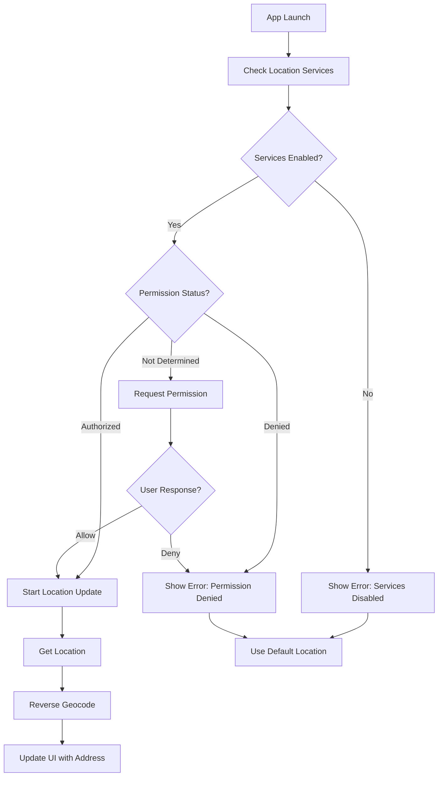

# Location Services Integration Setup

This document outlines the setup required to enable location services in the SuperOne iOS app.

## 📋 Required Setup Steps

### 1. Info.plist Configuration

Add the following keys to your app's `Info.plist` file:

```xml
<!-- Location Services Permission -->
<key>NSLocationWhenInUseUsageDescription</key>
<string>SuperOne uses your location to automatically detect nearby lab facilities and provide personalized health services in your area.</string>

<!-- Optional: More specific description -->
<key>NSLocationUsageDescription</key>
<string>Access to location helps SuperOne find the best lab facilities near you.</string>
```

### 2. Capabilities and Entitlements

Ensure the following capabilities are enabled in your Xcode project:

#### Target Capabilities:
- ✅ Location Services (automatically enabled when using CoreLocation)

#### App Capabilities (if needed):
- Background Location Updates (only if implementing background location features)

### 3. Privacy Manifest (iOS 17+)

If targeting iOS 17+, you may need to include location usage in your Privacy Manifest file (`PrivacyInfo.xcprivacy`):

```xml
<key>NSPrivacyAccessedAPITypes</key>
<array>
    <dict>
        <key>NSPrivacyAccessedAPIType</key>
        <string>NSPrivacyAccessedAPICategoryLocationServices</string>
        <key>NSPrivacyAccessedAPITypeReasons</key>
        <array>
            <string>NSPrivacyAccessedAPICategoryLocationServicesReasonAppFunctionality</string>
        </array>
    </dict>
</array>
```

## 🔧 Implementation Details

### LocationManager Integration

The app includes a comprehensive `LocationManager` class with the following features:

#### Core Features:
- ✅ Automatic permission handling
- ✅ Current location detection with reverse geocoding
- ✅ Graceful error handling and fallbacks
- ✅ Thread-safe operations with Swift 6.0+ concurrency
- ✅ Location caching (5-minute cache)
- ✅ Timeout handling (30-second timeout)
- ✅ Settings app integration

#### Usage in AppointmentsViewModel:
```swift
// Automatic location detection on app launch
private func setupLocationServices() {
    getCurrentLocation()
}

// Manual location refresh
func refreshLocation() {
    locationManager.resetLocationState()
    getCurrentLocation()
}
```

### User Experience States

The LocationSelectorButton handles multiple states:

1. **Loading State**: Shows "Getting location..." with spinner
2. **Success State**: Displays formatted address (e.g., "Mumbai, Maharashtra, IN")
3. **Permission Denied**: Shows "Location access denied" with settings link
4. **Error State**: Falls back to "Pune, Maharashtra, IN" with error message
5. **Manual Override**: Allows users to select location manually

### Location Permission Flow



## 📱 User Interface Elements

### LocationSelectorButton Features:
- **Visual States**: Different icons and colors for each state
- **Loading Indicator**: Progress spinner during location fetch
- **Error Handling**: Clear error messages with recovery options
- **Manual Entry**: Location picker sheet with search and popular cities
- **Settings Integration**: Direct link to open iOS Settings

### LocationPickerSheet Features:
- **Current Location Section**: Shows detected location with refresh option
- **Manual Entry**: Text field for custom location input
- **Popular Locations**: Quick selection grid with major Indian cities
- **Error Recovery**: Enable location button when permission denied

## 🔒 Privacy and Security

### Data Handling:
- Location data is only used for facility discovery
- No persistent storage of precise coordinates
- Only city/state level information is retained
- User can manually override detected location

### Permission Best Practices:
- Clear, specific usage description in Info.plist
- Request permission only when needed (not on app launch)
- Provide fallback functionality when permission denied
- Easy access to settings for permission changes

## 🧪 Testing Scenarios

### Test Cases to Verify:

1. **Permission Flow**:
   - [ ] First launch: Permission request appears
   - [ ] Allow permission: Location detected successfully
   - [ ] Deny permission: Fallback location used
   - [ ] Settings change: App responds to permission changes

2. **Location Detection**:
   - [ ] Success: Address formatted correctly
   - [ ] Network failure: Graceful fallback
   - [ ] Timeout: Error handling with retry option
   - [ ] No GPS signal: Appropriate error message

3. **User Interface**:
   - [ ] Loading state: Spinner appears
   - [ ] Success state: Address displayed
   - [ ] Error state: Error icon and message
   - [ ] Manual override: Location picker works

4. **Edge Cases**:
   - [ ] Airplane mode: Network error handling
   - [ ] Location services disabled: System error message
   - [ ] Background/foreground: State preservation
   - [ ] Memory warnings: Cleanup and recovery

## 📊 Performance Considerations

### Optimizations Implemented:
- **Location Caching**: 5-minute cache to reduce API calls
- **Request Timeout**: 30-second timeout to prevent hanging
- **Distance Filter**: 100-meter filter to reduce unnecessary updates
- **Accuracy Setting**: Best accuracy for precise lab discovery
- **Background Cleanup**: Proper timer invalidation and cleanup

### Battery Impact Mitigation:
- **When-In-Use Only**: No background location tracking
- **Single Request**: Uses `requestLocation()` instead of continuous updates
- **Timeout Management**: Prevents indefinite location requests
- **Fallback Strategy**: Reduces retry attempts on failure

## 🚀 Deployment Checklist

Before App Store submission:

1. **Info.plist**:
   - [ ] NSLocationWhenInUseUsageDescription added
   - [ ] Clear, user-friendly description provided
   - [ ] No unnecessary location permissions requested

2. **Testing**:
   - [ ] All permission scenarios tested
   - [ ] Edge cases handled gracefully
   - [ ] Performance impact acceptable
   - [ ] User experience smooth and intuitive

3. **Privacy**:
   - [ ] Privacy policy updated to mention location usage
   - [ ] Data handling practices documented
   - [ ] User control over location features maintained

## 📋 Code Files Modified

### New Files Created:
- `core/Services/LocationManager.swift` - Core location services implementation

### Files Modified:
- `Features/Appointments/ViewModels/AppointmentsViewModel.swift` - Location integration
- `Features/Appointments/Views/AppointmentsView.swift` - UI updates for location
- `core/Configuration/AppConfiguration.swift` - Location services feature flag

### Dependencies Added:
- CoreLocation framework (system framework)
- No external dependencies required

---

## ⚠️ Important Notes

1. **App Store Review**: Clear usage description is required for approval
2. **User Trust**: Be transparent about location usage to maintain user trust
3. **Fallback Required**: App must function without location permission
4. **Testing Required**: Test on actual device for accurate location services
5. **Privacy First**: Always respect user privacy preferences

This integration provides a seamless location experience while maintaining user privacy and providing robust fallback options.